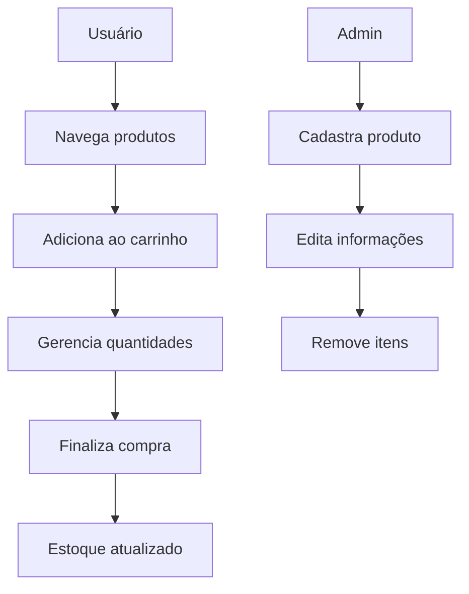

# 📝 README - Miniv - E-commerce com LocalStorage

## 🛠️ Tecnologias e Técnicas Utilizadas

### Frontend Puro

- **HTML5**: Estrutura semântica do projeto
- **CSS3**: Estilização moderna com variáveis CSS e Flexbox/Grid
- **JavaScript Vanilla**: Lógica da aplicação sem frameworks
- **Design Responsivo**: Adaptação para todos os tamanhos de tela

### Armazenamento

- **localStorage**: Persistência de dados no navegador
- **JSON**: Serialização dos dados para armazenamento

### Padrões de Projeto

- **Módulos JS**: Separação lógica em arquivos distintos
- **API Simulada**: Abstração das operações de dados
- **CRUD Completo**: Create, Read, Update e Delete para produtos

### UI/UX

- **Modais**: Para confirmação de ações
- **Carrinho Flutuante**: Acesso rápido sem sair da página
- **Feedback Visual**: Estados interativos para ações do usuário

## 📌 Casos de Uso

### 1. Administração de Produtos

**Cenário**: Loja virtual precisa gerenciar catálogo
**Fluxo**:

1. Acessar painel administrativo
2. Cadastrar novo produto (nome, preço, estoque)
3. Editar informações quando necessário
4. Remover produtos descontinuados

**Benefícios**:

- Atualização em tempo real
- Sem necessidade de backend
- Interface intuitiva

### 2. Processo de Compra

**Cenário**: Cliente finalizando pedido
**Fluxo**:

1. Navegar pelos produtos
2. Adicionar itens ao carrinho
3. Ajustar quantidades
4. Finalizar compra (estoque é atualizado automaticamente)

**Benefícios**:

- Experiência fluida
- Cálculo automático de totais
- Confirmação visual da compra

## 🔍 Estudo de Caso

### Problema

Pequeno varejista precisa de solução e-commerce:

- Baixo orçamento
- Sem infraestrutura para backend
- Equipe com conhecimento básico de frontend

### Solução Implementada

1. **Armazenamento local**: Elimina necessidade de servidor
2. **Interface simples**: Facilita adoção pela equipe
3. **Funcionalidades essenciais**: Catálogo + carrinho + checkout

### Resultados

- Implementação em 1 dia útil
- Custo zero de hospedagem
- Fácil manutenção pela equipe interna

## 📊 Fluxos Principais

## 🚀 Como Executar

1. Clone o repositório
2. Abra o arquivo `index.html` no navegador
3. Interaja com a interface

## 📌 Sobre (About)

**Pure JS E-commerce**: A complete frontend e-commerce solution using only vanilla JavaScript, HTML5 and CSS3. Features include localStorage for data persistence, responsive design, product management (CRUD), shopping cart and simulated checkout. No frameworks or libraries required.
